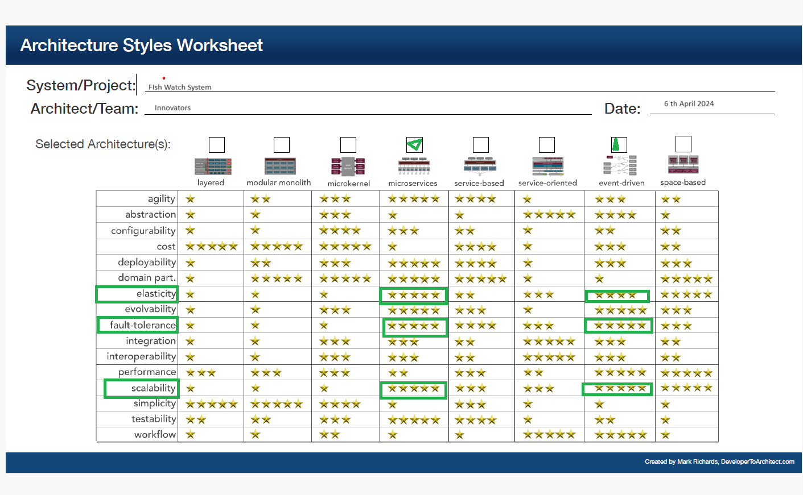

# FishWatch Architecture Analysis

## Company Overview
Livestock Insights Incorporated, headquartered in Scotland, operates globally. Their flagship service, **Fishy Watch**, is widely used by fish farmers worldwide. **Fishy Watch** enables monitoring of fish health and overall fish farm conditions. It collects critical data about individual fish, water quality, and weather conditions. Fish farmers rely on this information to assess livestock health, detect signs of parasites and diseases, and optimize harvest timing.

## Requirements

### Customer Farms:
- Customers may operate multiple fish farms across different geographical locations.
- Farm sizes vary, from small single-farm operations to large clients managing over a hundred farms.
- Each farm consists of multiple enclosures where fish are kept. Enclosure counts range from as few as ten to potentially over a thousand.
- The largest farms may house millions of fish.

### Monitoring Devices:
- **Water Monitors**:
  - Installed in each enclosure.
  - Capture water quality data, including pH, temperature, salinity, oxygen levels, and other relevant factors.
- **Underwater Cameras**:
  - Positioned in each enclosure.
  - Provide a general view of fish health, assessing size, activity, and parasite presence.
- **Fish-ual Recognition (Beta)**:
  - Identifies individual fish for health and lifecycle monitoring.

### Dashboard Customization and Alerts:
- **Farmers**:
  - Need customizable dashboards to view collected data.
  - Specify alert thresholds (e.g., pH out of bounds, adverse weather predictions).
- **Harvest Data**:
  - Raw data, combined with harvested fish information, informs models for optimal harvest conditions.
- **Multiple Fish Species**:
  - Each farm may raise various fish species.
- **Large Customers**:
  - Seek insights across multiple farms.
- **Timely Alerts**:
  - Critical for preventing adverse events due to water quality degradation or extreme weather.
- **Future Enrichment**:
  - Expect more detailed fish behavior and water quality data as advanced devices are deployed.

### Accessibility and Connectivity:
- **Devices**:
  - Accessible from various devices, including rugged industrial ones used during sea harvests.
- **Remote Locations**:
  - Fish farms often operate in remote areas with poor cellular signal.
- **Data Transmission**:
  - Define how existing hardware devices will transmit water and fish behavior data to the system.

### Expansion and Adaptation:
- **Cattle Capabilities**:
  - Consider extending similar features to cattle monitoring.
- **Aquarium Integration**:
  - Allow aquariums to use the system for fish health management.

## Additional Considerations

### Usability
- **Intuitive Interfaces**:
  - Design user-friendly dashboards and configuration screens.
  - Provide clear visualizations and meaningful alerts.
  - Consider user training and documentation.

### Performance
- **Real-time Processing**:
  - Optimize data processing for live monitoring.
  - Efficiently handle large-scale data streams.
  - Minimize latency for alerts and insights.

### Security
- **Data Protection**:
  - Encrypt data in transit and at rest.
  - Implement access controls and authentication mechanisms.
  - Regularly audit security practices.
- **Privacy**:
  - Ensure compliance with data privacy regulations.
  - Anonymize sensitive data (e.g., individual fish identification).
  - Protect customer and farm information.

## Architecture Styles
Using the analysis of the key non-functional properties above and with the help of  the [worksheet](https://www.developertoarchitect.com/downloads/architecture-styles-worksheet.pdf), we compared a few styles and finalized one that will give us the most benefits with respect to the non-functional properties above. 

As shown in the table, Microservices, Service-based and event-based architectures were the most suitable candidates. 
We selected both the styles for this application

The detailed choice of Microservices architecture is documented in [ADR_001_Architecture_Style](../Architecture_Decision_Reports/ADR_001_Architecture_Style.md).

Here's a high-level architecture based on the provided requirements and considerations:

1. **Data Collection Layer**:
   - Various **IoT devices** installed in fish farms:
     - **Water Monitors** capture water quality data (pH, temperature, salinity, oxygen levels, etc.).
     - **Underwater Cameras** monitor fish health (size, activity, parasite presence).
     - Data transmitted using **MQTT** for reliability in remote locations.

2. **Data Ingestion and Processing Layer**:
   - Cloud-based system (e.g., **AWS IoT Core**, **Azure IoT Hub**):
     - Securely ingests data from IoT devices.
     - Real-time processing using **Apache Kafka** or **AWS Kinesis**.
     - Alerts triggered based on predefined thresholds.

3. **Data Storage Layer**:
   - **Scalable and distributed database**:
     - **Time-series databases** (e.g., **InfluxDB**) for sensor data.
     - **PostgreSQL** for metadata (farms, enclosures, fish species).

4. **Data Analysis and ML Layer**:
   - Generate insights and build predictive models:
     - **Apache Spark** for large-scale data processing.
     - **TensorFlow** or **PyTorch** for ML models.

5. **Application Layer**:
   - Web-based applications for farmers:
     - **Customizable dashboards** visualize data and insights.
     - Built with **React** or **Angular**.
     - Hosted on **AWS** or **Azure** for scalability.

6. **API Layer**:
   - Provides secure APIs for application layer:
     - Controlled access to data and system functionalities.

7. **Security Layer**:
   - Ensures security across all layers:
     - **Data protection**: Encryption in transit and at rest.
     - **Access controls** and authentication mechanisms.
     - Regular security audits.

This architecture allows scalability, flexibility, and potential expansion to other livestock monitoring or use cases.

[Previous Page](./Event-Storming.md) | [Next Page](./SystemArchitecture.md)