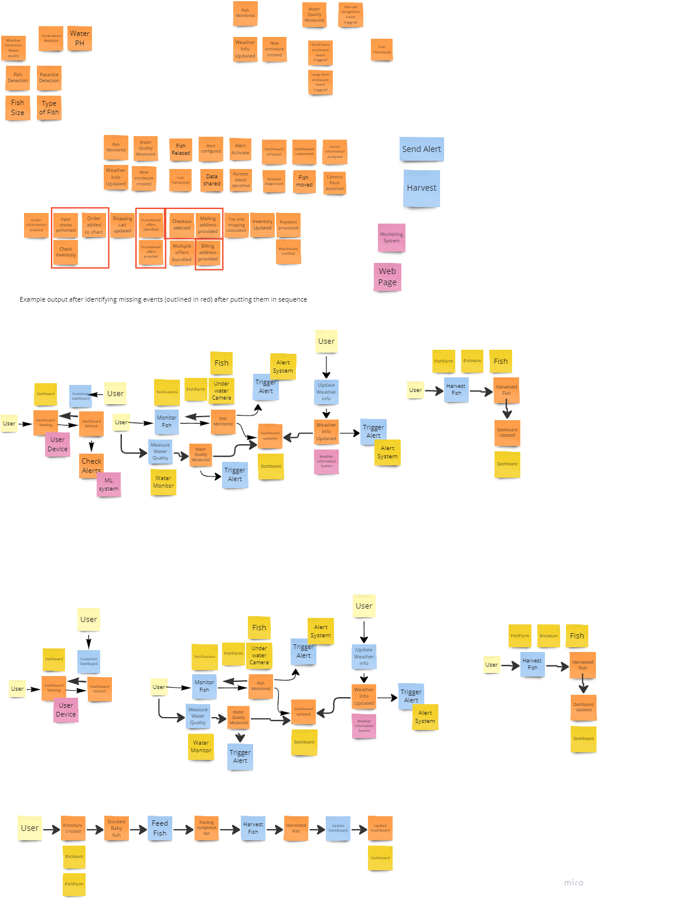

## Eventstorming

Once we finalized the requirement, we started with the event storming about the systems, actors, functional and non-functional requirements.

Here is how our Event storming document look like:

[Previous Page](../README.md) | [Next Page](./ArchAnalysis.md)