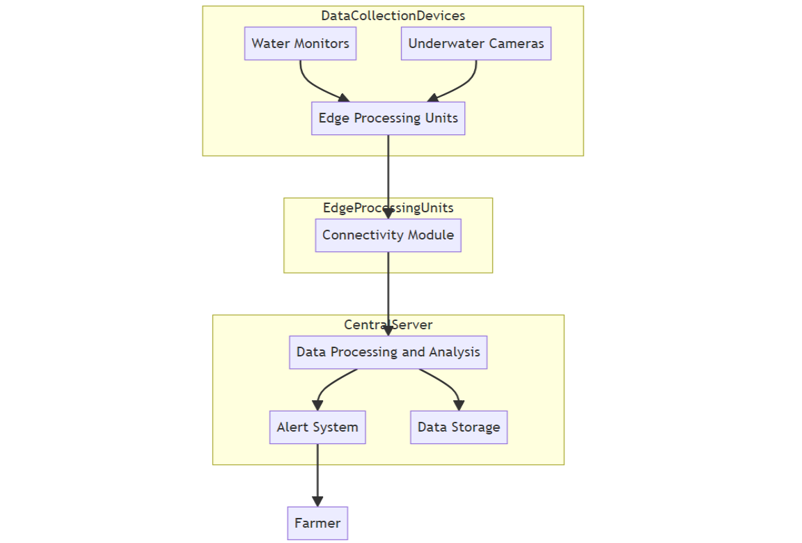

# FishWatch System Architecture

## Data Collection Devices
- **Water Monitors**:
  - Capture water quality data (pH, temperature, salinity, oxygen levels).
  - Operate in low-connectivity areas.
  - Rugged design for harsh fish farm conditions.
- **Underwater Cameras**:
  - Monitor fish health (size, activity, parasite presence).
  - Withstand challenging environments.

## Edge Processing Units
- Deployed at each farm:
  - Process data locally to reduce reliance on constant connectivity.
  - Handle tasks like image processing for fish-ual recognition, basic data analysis, and local storage.

## Connectivity Module
- Responsible for transmitting data from edge processing units to the central server.
- Designed for intermittent connectivity:
  - Stores data locally during poor connectivity.
  - Transmits when connection improves.

## Central Server
- Collects and stores data from various farms.
- Robust data ingestion capabilities for large volumes of incoming data.

## Data Processing and Analysis
- In the central server:
  - Clean data.
  - Integrate with other data sources.
  - Perform analyses for insights.

## Alert System
- Monitors processed data.
- Triggers alerts based on predefined thresholds.
- Timely alerts enable necessary farmer actions.

## Data Storage
- Securely stores all collected data.
- Scalable system to accommodate increasing data volume over time.

This architecture ensures efficient data collection and processing, even in challenging conditions. It delivers crucial information to farmers promptly and provides a foundation for future expansion to handle other livestock or aquariums.

