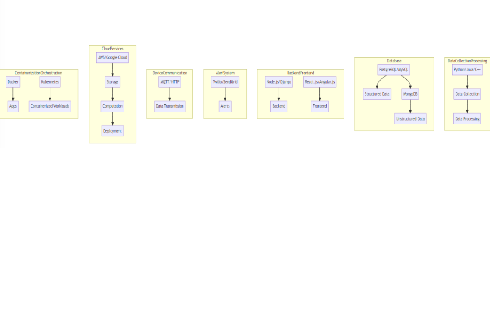

# FishWatch Tech Stack

1. **Data Collection & Processing**:
   - Languages: Python, Java, or C++ (robust libraries for data manipulation and analysis).

   - Collect and process data from sensors and cameras.

2. **Database**:
   - Structured Data: PostgreSQL or MySQL.
   - Unstructured Data: MongoDB.

3. **Backend**:
   - Node.js or Django (robust, scalable, good community support).
   The Decision regarding this is documented in ADR_006_Django%20and%20python%20for%20analytics%20and%20reporting](../Architecture_Decision_Reports/ADR_006_Django%20and%20python%20for%20analytics%20and%20reporting.md)

4. **Frontend**:
   - React.js or Angular.js (powerful, flexible for UI).
   Angular is selected as the frame work based on  [ADR_002_Angular Vs React as frontend](../Architecture_Decision_Reports/ADR_002_Angular%20vs%20React%20as%20frontend.md)

5. **Alert System**:
   - Twilio or SendGrid (SMS/email alerts).

6. **Device Communication**:
   - MQTT or HTTP (lightweight messaging for sensors).
   - Ensure reliable data transmission.
   The selection of this documented in 
   [ADR_007_%20Hybrid_Solution_for_Fish_Farm_Data_Transmission](../Architecture_Decision_Reports/ADR_007_%20Hybrid_Solution_for_Fish_Farm_Data_Transmission.md)

7. **Cloud Services**:
   - Azure or AWS or Google Cloud (storage, computation, deployment).

8. **Containerization & Orchestration**:
   - Docker (develop, ship, run apps).
   - Kubernetes (manage containerized workloads).

Note: Choose technologies based on TCO and team expertise.

[Previous Page](./SystemLevel.md) | [Next Page](../Architecture_Decision_Reports)
