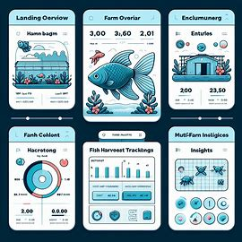
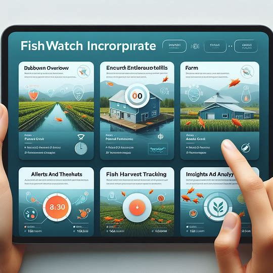
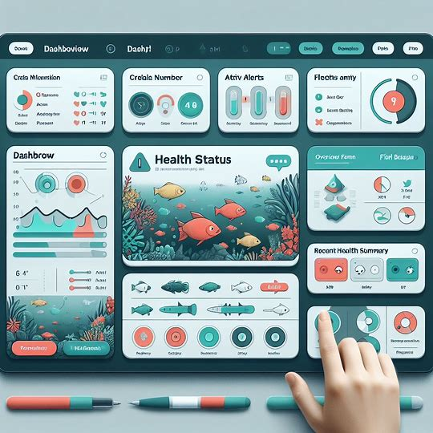
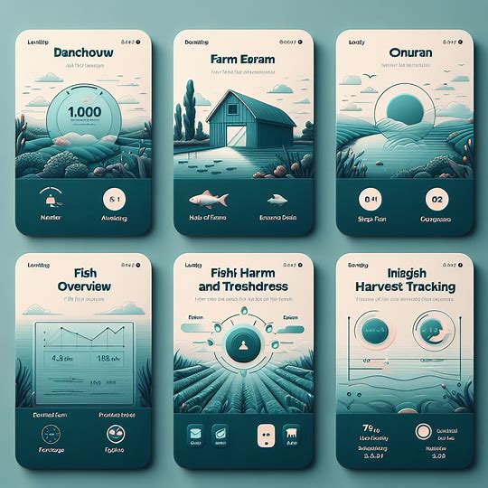
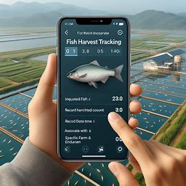
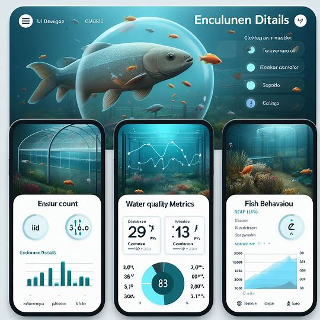
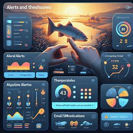

## FishWatch System UI Mockup

# FishWatch System Features

## 1. Dashboard Overview
- Upon logging in, users are greeted with an overview dashboard.
- Critical information displayed:
  - Total number of fish farms.
  - Active alerts (if any).
  - Recent health status summary.
- Customizable dashboard allows farmers to arrange widgets.

## 2. Farm Overview
- Users can select a specific fish farm from a list.
- Farm overview provides essential details about the selected farm:
  - Number of Enclosures.
  - Total Fish Count.
  - Water Quality Summary (pH, temperature, salinity, oxygen levels).
  - Recent Fish Health Status (based on underwater camera data).
  - Alerts (highlighted issues).

## 3. Enclosure Details
- Clicking on an enclosure reveals more information:
  - Enclosure ID (unique identifier).
  - Fish Count (current population).
  - Water Quality Metrics (real-time graphs).
  - Fish Behavior (live video feed from underwater cameras).
  - Parasite Detection Status (alerts if parasites detected).
  - Fish-ual Recognition (if available).

## 4. Alerts and Thresholds
- Users set custom thresholds (e.g., pH, temperature).
- Alerts triggered when thresholds exceeded:
  - Visual Alerts on Dashboard (highlighted areas or color changes).
  - Email/SMS Notifications.

## 5. Fish Harvest Tracking
- Separate section to track harvested fish:
  - Input Harvested Fish Count.
  - Record Date and Time.
  - Associate with Specific Farm and Enclosure.

## 6. Insights and Analytics
- System analyzes historical data to improve harvest success:
  - Correlations (water quality, fish behavior, successful harvests).
  - Predictive Models (optimal harvest timing).

## 7. Multi-Farm Insights
- For large customers with multiple farms:
  - Compare Performance Across Farms.

This is how the diagram looks like:

Next, we shall showcase couple of screen mockups.

[Previous Page](./ComponentDiagram.md) | [Next Page](./ViewTrip.md)