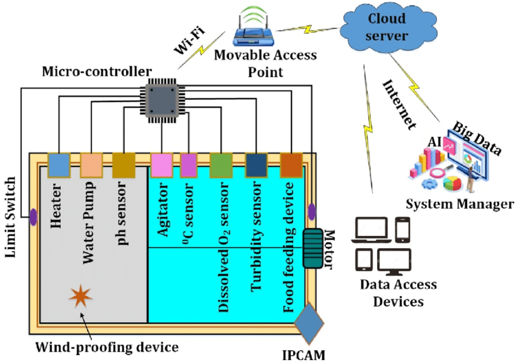
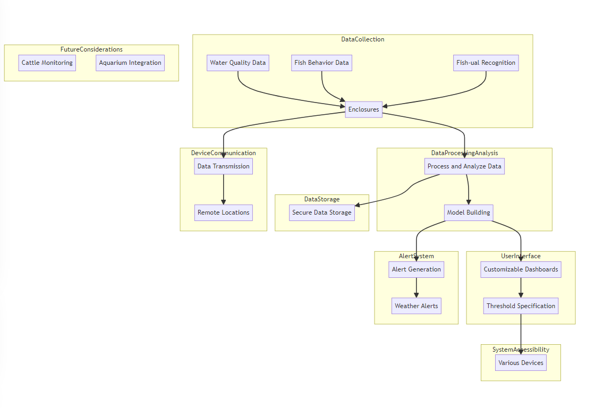

# FishWatch System User story

## 1. Data Collection
- Collect water quality data from each enclosure in a fish farm.
- Collect fish behavior data from underwater cameras in each enclosure.
- Identify individual fish using fish-ual recognition to monitor their health and lifecycle.
- The proposed system is a smart IoT-based fish monitoring and control system equipped with different IoT devices to enable real-time data collection.
- The fishfarm container water-quality conditions and other system parameters can be readily monitored, adjusted, and assessed remotely.

Courtesy - [https://www.researchgate.net/figure/A-fish-pond-equipped-with-automatic-control-of-multiple-sensors-multiple-actuators-and_fig2_362789096](https://www.researchgate.net/figure/A-fish-pond-equipped-with-automatic-control-of-multiple-sensors-multiple-actuators-and_fig2_362789096)

## 2. Data Processing and Analysis
- Process and analyze the collected data to understand livestock health and detect signs of parasites and disease.
- Use the data and harvested fish information to build a model for optimal harvest conditions.
- To predict the growth of the container fish species, this also develops a deep learning model (DL) that correlates the different parameters of the smart aquaculture system.
- Example of Autonomous feeding system:
  - Bayesian optimization-based hyper-parameter tuning was employed to find the optimal DL model configuration to produce accurate predictions on the given experimental data set.
  - The optimal model produces an R 2 value of 0.94 and a mean square error of 0.0015, demonstrating the applicability of the model to predict the desired output.
  - Based on the results of the experiments, the DL model can be incorporated into the autonomous feeding system, reducing the amount of leftover feed.

## 3. User Interface
- Farmers need:
  - Customizable dashboards to view collected information.
  - Specify alert thresholds.

## 4. Alert System
- Generate alerts when predefined thresholds are breached.
- Provide advanced warnings of adverse weather events.

## 5. Data Storage
- Store processed data and analysis results securely for future reference.

## 6. System Accessibility
- Farmers can access FishWatch from various devices, including rugged industrial ones used during harvest.

## 7. Device Communication
- Define how hardware devices will transmit information to the system.
- Consider poor cellular signal in remote fish farm locations.

## 8. Future Considerations
- Automatic detection of fish ready to harvest and use of pump to direct cultivated fish to shipment tank
Below diagram from [https://www.toyota-tsusho.com/english/press/detail/180821_004238.html](https://www.toyota-tsusho.com/english/press/detail/180821_004238.html)

- Extend similar capabilities to cattle monitoring.
- Allow aquariums to use the system for fish health management.

[Previous Page](./UI_Mock.md) | [Next Page](./Deployment.md)

