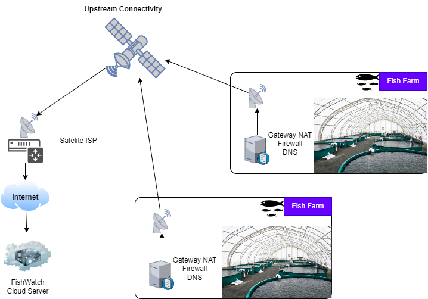

# Title: Architecture Decision Record (ADR) - Hybrid Solution for Fish Farm Data Transmission

## Status

APPROVED

# Architecture Decision Record (ADR) - Hybrid Solution for Fish Farm Data Transmission

## Context
Fish farms are often located in remote areas with poor cellular signal. Reliable data transmission is critical for monitoring water quality and underwater cameras. We propose a hybrid solution that combines satellite communication and mesh networks to address this challenge.

## Decision
We recommend implementing a hybrid approach that leverages both satellite communication and mesh networks:

1. **Satellite Communication:**
   - Utilize satellite networks for data transmission.
   - Data is transmitted from each fish farm to a satellite, which relays it to a ground station.
   - **Benefits:**
     - Independent of cellular networks.
     - Suitable for remote and isolated locations.
     - Reliable but may have latency.
   - **Considerations:**
     - Requires satellite equipment and subscription.
     - Evaluate costs for multiple locations.

2. **Mesh Networks:**
   - Create a network of interconnected devices (nodes) at each fish farm.
   - Nodes communicate directly with nearby nodes.
   - Data hops from node to node until it reaches a gateway connected to the central system.
   - **Advantages:**
     - Self-healing (if a node fails, data finds an alternative path).
     - Scalable and adaptable.
     - Works well in challenging terrains.
   - **Considerations:**
     - Careful placement of nodes for optimal coverage.
     - Evaluate scalability for multiple farms.

## Rationale
- **Reliability:** The hybrid solution ensures data transmission even in remote locations.
- **Adaptability:** Combining satellite and mesh networks provides redundancy and flexibility.
- **Cost-Effectiveness:** Satellite communication covers remote areas, while mesh networks handle local connectivity.

## Consequences
- Implementation complexity due to managing both technologies.
- Cost considerations for satellite equipment and subscriptions.

This ADR captures our architectural decision to use a hybrid solution, balancing reliability and adaptability across multiple fish farms. It provides a robust foundation for seamless data transmission.

[Home Page](../README.md) | [ADR Home Page](../Architecture_Decision_Reports)
