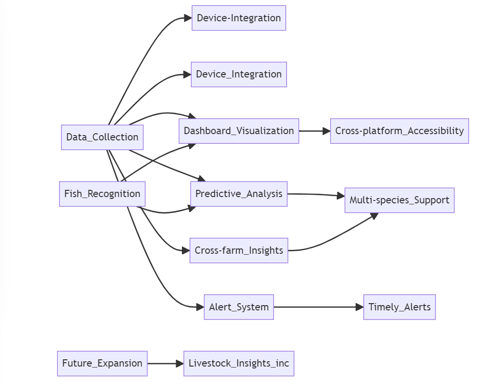

## Functional Overview

The high-level functional requirements for the new Road Warrior are as follows.

# FishWatch

## Functional Overview

1. **Data Collection**: The system collects data about individual fish, water quality, and weather information from each enclosure in a farm. This includes PH, temperature, salinity, oxygen levels, and other factors.

2. **Fish Recognition**: A beta feature is live where individual fish can be identified via fish-ual recognition, to monitor the health and lifecycle of an individual fish.

3. **Dashboard Visualization**: Farmers can view the collected information in customizable dashboards.

4. **Alert System**: Farmers can specify thresholds at which alerts should be triggered. This could be simple things like a PH going out of bound, but could also involve advanced warnings of adverse weather events which are expected.

5. **Predictive Analysis**: Information about the fish harvested from each farm, together with the raw data being collected, is used to build a model of what factors produce good harvests.

6. **Multi-species Support**: Each farm may have a variety of different fish species.

7. **Cross-farm Insights**: For large customers, they will want to be able to drive insights across a number of farms.

8. **Timely Alerts**: It’s vital that alerts be generated in a timely manner - a sharp degradation in water quality or adverse weather event could have massive implications if the farmer doesn’t have enough warning.

9. **Device Integration**: The system needs to define how the hardware devices to capture water information and detect fish behaviour will send the information to the system.

10. **Cross-platform Accessibility**: Fish Watch needs to be accessible from a number of devices, including rugged industrial devices used on the sea during harvest.

11. **Future Expansion**: Livestock Insights inc is considering providing similar capabilities to cattle, and also allowing aquariums to use the system to look after fish health.

[Previous Page](./DriversGoals.md) | [Next Page](../README.md#solution)
