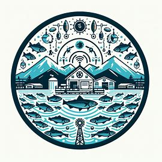

# Architectural Kata: April 2024: Fish Watch

 

## Members

## Team Members

- Suresh B
- Kanakaraj Chinnamuthu
- Rajesh Kumar Nair
- Jayesh Prajapati

## Presentation
<video controls src="artifacts/FishWatchArchitecure.mp4" title="Fish Watch Architecure"></video>

## Requirement Analysis

* [Business Context](./Functional/context.md)
* [Drivers and Goals](./Functional/DriversGoals.md)
* [Functional Overview](./Functional/functional-overview.md)

## Solution
* [Event Storming](./Architecture/Event-Storming.md)
* [Architecture Analysis](./Architecture/ArchAnalysis.md)
* [System Architecture](./Architecture/SystemArchitecture.md)

* [User Journey](./Architecture/Userjourney.md)
* [Component Diagram](./Architecture/ComponentDiagram.md)
* [Sequence Diagram](./Architecture/SequenceDiagram.md)
* [UI Mockup](./Architecture/UI_Mock.md)
* [User Story](./Architecture/UserStory.md)
* [Deployment DIagram](./Architecture/Deployment.md)
* [System Level Diagram](./Architecture/SystemLevel.md)
* [Technical Stack](./Architecture/TechnicalStack.md)
* [Architectural Decision Records (ADRs)](./Architecture_Decision_Reports)

## Future Roadmap
The future enhancements in Fish Watch architecture are based upon the long-term business requirements and evolvability of the application.
 Following are the current roadmap consideration
- **Cattle Capabilities**:
  - Consider extending similar features to cattle monitoring.
- **Aquarium Integration**:
  - Allow aquariums to use the system for fish health management.

## References
* [C4 Model](https://c4model.com/)
* [Fundamentals of Software Architecture](https://learning.oreilly.com/library/view/fundamentals-of-software/9781492043447/)
* [API Gateway Pattern](https://microservices.io/patterns/apigateway.html) 
* [Building Microservices](https://learning.oreilly.com/library/view/building-microservices-2nd/9781492034018/)  
* [Building Event-Driven Microservices](https://learning.oreilly.com/library/view/building-event-driven-microservices/9781492057888/)  
* [Architecture: The Hard Parts](https://alistair.cockburn.us/hexagonal-architecture/)  
* [Documenting Software Architectures Views and Beyond](https://learning.oreilly.com/library/view/documenting-software-architectures/9780132488617/)  
* [Previous Kata Entries](https://github.com/TheMarmots/ArchKatas2022.git)
